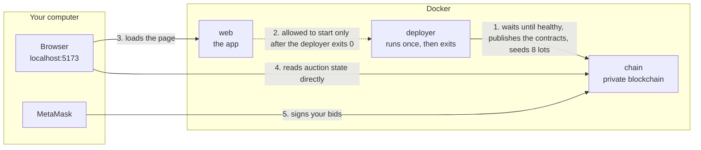

# Smart Auction Network

An auction house that runs on a blockchain. A seller puts a digital item up for
sale. Bidders compete against a deadline. When the clock runs out, a program
that nobody can alter hands the item to the winner and the money to the seller.
No company sits in the middle, and no one can lose their money by being ignored.

Everything in this repository runs on your own computer. It needs no account
with any service, no API key, no test network and no real money.

> **Who this is for.** You do not need to know anything about blockchains to
> run this or to follow this document. Every technical word is explained the
> first time it appears, and there is a [glossary](#glossary) at the end.

---

## Contents

1. [What this is, in plain words](#what-this-is-in-plain-words)
2. [Why it was rebuilt](#why-it-was-rebuilt)
3. [Set it up in ten minutes](#set-it-up-in-ten-minutes)
4. [A guided tour of the demo](#a-guided-tour-of-the-demo)
5. [How it works](#how-it-works)
6. [The two auction formats](#the-two-auction-formats)
7. [How money and items move safely](#how-money-and-items-move-safely)
8. [Design decisions you may want to debate](#design-decisions-you-may-want-to-debate)
9. [What is in the repository](#what-is-in-the-repository)
10. [Every command](#every-command)
11. [How it is tested](#how-it-is-tested)
12. [Optional extras: indexer, monitoring, AI agent](#optional-extras-indexer-monitoring-ai-agent)
13. [When something goes wrong](#when-something-goes-wrong)
14. [Glossary](#glossary)
15. [Contributing and licence](#contributing-and-licence)

---

## What this is, in plain words

Imagine an auction where the rules are written down once, in public, and then
enforced by a machine that no one can bribe, switch off or talk out of it. That
machine is a **smart contract**: a small program stored on a blockchain. Once
it is published, its rules cannot be changed. Everyone can read them.

This project is such a program, plus a web page to use it, plus everything
needed to run the whole thing on a laptop:

- **The contract** holds the item being sold and the money being bid, and
  applies the rules: who is winning, when the auction ends, who gets what.
- **The web app** shows the auctions, lets you bid, and shows you what the
  contract has actually recorded, never a guess.
- **A private blockchain** runs inside a container on your machine, so you can
  try everything with play money.

The items are **NFTs**: tokens that represent one specific thing, like a
numbered certificate of ownership. In the demo they are pictures with names,
but the contract does not care what they depict.

---

## Why it was rebuilt

The first version of this project looked finished and worked in a demo. A
security review found that it could not be trusted with real value:

| What was wrong                                                                           | Why it mattered                                           |
| ---------------------------------------------------------------------------------------- | --------------------------------------------------------- |
| The contract paid the seller but never handed the item to the winner.                    | You could pay and receive nothing.                        |
| A losing bidder had no way to get their money back if nobody outbid them.                | The normal outcome of a quiet auction was permanent loss. |
| A bidder could re-enter the contract during a refund and take money from other lots.     | One attacker could drain everyone.                        |
| A bidder who refused to accept a refund froze the auction at the minimum price.          | One cheap bid won any lot.                                |
| The web page said "Auction ended successfully" even when the transaction had failed.     | The screen lied about what happened on chain.             |
| No auction could be created at all: the form sent five values to a function taking four. | The core feature did not work.                            |

Rather than patch it, the project was rebuilt. Every problem above now has an
automated test named after it that proves the exploit fails. The old contract
is kept at `contracts/legacy/` only so `make audit` can compare against it.

---

## Set it up in ten minutes

### What you need

| Tool                                                              | Why                                                                                        | Check it             |
| ----------------------------------------------------------------- | ------------------------------------------------------------------------------------------ | -------------------- |
| [Docker Desktop](https://www.docker.com/products/docker-desktop/) | Runs the blockchain, the deployer and the web app in containers                            | `docker --version`   |
| [Git](https://git-scm.com/)                                       | Downloads the code                                                                         | `git --version`      |
| [MetaMask](https://metamask.io/) browser extension                | A wallet: your identity and your "sign here" button. Only needed to bid, list or withdraw. | Browser toolbar icon |

You do **not** need Node.js to run the demo; the containers bring their own. You
need it only to run the tests or change the code. If you do install it, it
MUST be the 64-bit build. See [When something goes wrong](#when-something-goes-wrong).

### Start it

```bash
git clone https://github.com/prpawan03/decentralised_auction.git
cd decentralised_auction
cp .env.example .env
make up
```

On Windows PowerShell there is no `make`; use `npm run up`, or run the
`docker compose up -d --build` command directly. Every `make` target has an
`npm run` twin; `npm run help` lists them.

The first start builds the images and takes a few minutes. Afterwards it takes
about two. Three services come up, in a strict order:

| Service    | What it does                                                                  | Address                 |
| ---------- | ----------------------------------------------------------------------------- | ----------------------- |
| `chain`    | A private Ethereum blockchain. Mines one block every two seconds.             | `http://127.0.0.1:8545` |
| `deployer` | Publishes the contracts to the chain, creates eight demo auctions, then exits | none                    |
| `web`      | The web app. Starts only after the deployer has finished successfully.        | `http://localhost:5173` |

Open <http://localhost:5173>. You will see eight live auctions immediately.
You can browse, search, sort and inspect everything **without a wallet**.

### Connect a wallet, to bid

The private chain creates ten accounts. Each holds 10,000 test ETH. This is
play money that exists only on your machine.

1. In MetaMask choose **Add network → Add a network manually**:

   | Field           | Value                   |
   | --------------- | ----------------------- |
   | Network name    | `Auction Local`         |
   | RPC URL         | `http://127.0.0.1:8545` |
   | Chain ID        | `31337`                 |
   | Currency symbol | `ETH`                   |

   The app also offers a **Switch network** button that fills this in for you.

2. Choose **Import account → Secret Recovery Phrase** and enter the phrase from
   `.env.example`:

   ```
   test test test test test test test test test test test junk
   ```

   > **This phrase is public on purpose.** Every Ethereum development tool ships
   > it. The accounts are worthless, exist only on your machine, and MUST never
   > be used on a real network. See [SECURITY.md](SECURITY.md).

3. Import at least two accounts. A seller cannot bid on their own auction, so
   you need a second identity to see a bidding war.

### Stop it

```bash
make down     # stop, keep nothing running
make clean    # stop and delete every container, image and volume
```

---

## A guided tour of the demo

The eight seeded auctions are chosen to show every state the contract can be in:

| Lot | What it demonstrates                                                                             |
| --- | ------------------------------------------------------------------------------------------------ |
| 0   | Already **settled**: the winner holds the item, the seller has been paid.                        |
| 1   | Closed **below its reserve**: the item went back to the seller, the bidder was refunded in full. |
| 2   | Live, no bids yet.                                                                               |
| 3   | Live with competing bids. Try outbidding the leader.                                             |
| 4   | Live with a **buy-now** price. Pay it and the auction settles instantly.                         |
| 5   | Live and **ending soon**. Bid inside the last five minutes to see the clock extend.              |
| 6   | A **Dutch** auction: the price falls every block until someone buys.                             |
| 7   | A second Dutch auction, further down its slope.                                                  |

Things worth trying, in order:

1. **Bid too little.** Open lot 3, type a bid below the minimum. The app
   simulates the transaction against the contract before it asks you to sign,
   tells you exactly what the minimum is, and disables the button. No gas is
   spent on a bid that would fail.
2. **Get outbid, then withdraw.** Bid on lot 3 from one account, outbid it from
   another, then open **Portfolio** as the first account. Your money is waiting
   in your withdrawable balance. Nothing was sent to you automatically; you
   collect it. That is the single most important safety rule in the system,
   explained [below](#how-money-and-items-move-safely).
3. **Trigger the anti-snipe rule.** Bid on lot 5 inside its last five minutes.
   The deadline moves out by five minutes and the page says so.
4. **Settle from a third account.** After a lot passes its deadline, anyone can
   press **Settle**, not only the seller or the winner. The item moves and the
   money is credited in one transaction.
5. **Buy a Dutch lot.** Watch the price on lot 6 fall, then buy. Any
   overpayment caused by the price dropping while you signed is credited back
   to your balance, not lost.

Want a specific situation? `make scenario SCENARIO=snipe-in-progress` reloads
the chain into a prepared state. The other scenarios are `ending-soon`,
`reserve-not-met` and `dutch-falling`.

---

## How it works

### The pieces



Two things in that picture are unusual, and both are deliberate.

**The browser talks to the blockchain directly.** The web server only hands out
the page. Every number you see, the current bid, the time left, the price of a
Dutch lot, is read by your browser from the contract itself. There is no
database that could be stale and no middle layer that could lie.

**The start order is enforced, not hoped for.** The web app cannot start until
the deployer has finished and exited with success. If publishing the contracts
fails, you get a clear error instead of a page full of empty tables.

### What happens when you bid

```mermaid
sequenceDiagram
    participant You
    participant App as Web app
    participant Chain as Contract
    You->>App: type 2.6 ETH
    App->>Chain: simulate bid(lot 3) with 2.6 ETH
    Chain-->>App: would succeed, needs 51,000 gas
    App->>You: show minimum, fee and total; enable the button
    You->>App: press Bid
    App->>You: MetaMask asks you to sign
    You->>Chain: signed transaction
    Chain->>Chain: previous leader is CREDITED 2.5 ETH (not paid)
    Chain-->>App: receipt: success, block 1,204
    App->>You: "Bid confirmed", only now
```

Three checkpoints protect you: the simulation before you sign, the wallet
prompt that shows the real cost, and the receipt that has to arrive before the
app claims success. The old version skipped the first and the last.

### Time

The contract decides "ended" by the block clock, not by your laptop's clock.
The two can differ by minutes on a private chain. The app therefore anchors
every countdown and every Dutch price to the latest block's timestamp, so what
you see agrees with what the contract will do.

---

## The two auction formats

**English (ascending).** The classic format. Bids must rise by at least a
minimum step, 5% by default, which the seller can change per lot. A seller may
set a **reserve**, the lowest price they will accept; if the top bid ends below
it, the item goes back and the bidder is refunded. A seller may also set a
**buy-now** price for instant purchase. A bid inside the final five minutes
extends the deadline by five minutes, up to twenty times, so the auction cannot
be won by a bid placed one second before the close.

**Dutch (descending).** The price starts high and falls in a straight line to a
floor over the auction's duration. The first person to pay the current price
wins, immediately. There are no bids to outbid, so there is nothing to snipe.
The app shows the live price and the floor.

Both formats share one contract, one escrow ledger and one settlement path, so
every safety rule below applies to both.

---

## How money and items move safely

Three rules, each closing a way the original version lost money.

**1. The contract never sends money on its own.** When you are outbid, when you
win, when you sell: the contract writes down what it owes you, and you call
`withdraw()` to collect. This sounds like a detour. It is the reason a hostile
bidder cannot break an auction: in the old design the contract _pushed_ refunds,
and a bidder whose wallet refused the payment made every later bid fail, which
froze the lot at their price. A ledger entry cannot refuse to be written.

**2. Anyone can settle an expired auction.** Not only the seller. In the old
design only the seller could close an auction, and a seller who never did held
every bidder's money forever. Now the deadline is real and settlement is open
to everyone, so nobody can hold your money by doing nothing.

**3. The item moves in the same transaction as the payment, and the payment
depends on the item moving.** The contract first tries to hand the NFT to the
winner. Only if that succeeds is the seller paid. If the transfer fails, for
example because the token's own code refuses it, the sale is voided, the winner
is refunded in full, and the item is held for the seller to reclaim. The seller
cannot be paid for something the buyer did not receive.

Two more rules sit underneath:

- **Each auction has its own escrow account.** One lot can never spend
  another lot's money, which is what the original drain exploited.
- **Pausing the house cannot trap funds.** The owner can pause new listings and
  bids in an emergency, but `withdraw()` and `settle()` can never be paused.

The anti-snipe extension is measured at 300 seconds on chain, the fee split is
tested to the wei, and the whole set of rules is expressed as **invariants**:
statements that must be true after any sequence of actions. The most important
one reads, roughly, "the contract always holds at least as much ETH as it owes
to everyone combined." A fuzzer hammers the contract with thousands of random
actions and checks that statement after every one.

---

## Design decisions you may want to debate

These are positions, not facts. Each has a defensible opposite.

| Decision                                                            | The case for it                                                                                    | The case against it                                                                                |
| ------------------------------------------------------------------- | -------------------------------------------------------------------------------------------------- | -------------------------------------------------------------------------------------------------- |
| **The contract cannot be upgraded.**                                | What you audit is what runs, forever. No admin key can change the rules under you.                 | A bug found later cannot be patched in place; a new contract must be deployed.                     |
| **Refunds are pulled, not pushed.**                                 | Removes a whole class of attacks (rule 1 above).                                                   | One extra click for the user, and money that is "yours" sits in the contract until you collect it. |
| **Anyone can settle.**                                              | Nobody can hold your funds by refusing to close.                                                   | A stranger's transaction decides the exact settlement block.                                       |
| **Anti-snipe extensions are capped at twenty.**                     | The auction is guaranteed to end within 100 extra minutes.                                         | After the twentieth extension the protection is gone; Nouns DAO uses no cap.                       |
| **Formats are built in by inheritance, not plugged in as modules.** | A format has to move escrow, and giving that power to a separate contract is a new attack surface. | Adding a format means a new deployment rather than registering a module.                           |
| **The demo is local-only.**                                         | No keys, no accounts, no real money, reproducible for every reviewer.                              | It has not run on a public network and the code is **not audited**.                                |
| **The seller can raise their own bid step but not their own bid.**  | Stops a seller inflating the price with a hidden second account.                                   | A determined seller can still use a second wallet.                                                 |

The [architecture guide](docs/ARCHITECTURE.md) goes deeper on each, and
[SECURITY.md](SECURITY.md) states the trust model plainly.

---

## What is in the repository

```
.
├── contracts/               The blockchain side
│   ├── src/core/            AuctionCore.sol: escrow, ledger, settlement, fees, pause
│   ├── src/formats/         EnglishAuction.sol and DutchAuction.sol
│   ├── src/AuctionHouse.sol The single deployed contract that combines them
│   ├── src/DemoNFT.sol      A small NFT collection for the demo, with on-chain artwork
│   ├── src/vendor/          Multicall3, vendored (MIT) because the local chain has none
│   ├── legacy/              The original contract, kept only for `make audit`
│   ├── test/                Solidity tests: unit, fuzz, invariant, regression, attacker mocks
│   ├── test/integration/    TypeScript tests that drive full auction flows
│   └── scripts/             deploy, seed, export-abi
├── web/                     The browser app (React, TypeScript, Vite)
│   ├── src/features/        auctions, bidding, listing, portfolio, wallet
│   ├── src/abi/             Generated from the contracts. Never edited by hand.
│   └── scripts/             check-contrast: proves every colour pair meets WCAG 2.2 AA
├── indexer/                 Optional: indexes chain events into Postgres, serves GraphQL
├── mcp/                     Optional: lets an AI agent browse and bid, with hard limits
├── ops/                     Optional: Prometheus and Grafana configuration
├── docker/                  Dockerfiles, entrypoints, nginx config
├── docs/                    Architecture guide, contract interface, roadmap
├── scripts/                 Gate scripts CI runs: coverage floor, bundle size, action pins, smoke
├── compose.yaml             The three core services
├── compose.override.yaml    Development shape (Vite dev server)
├── compose.prod.yaml        Production shape (nginx serving a static bundle)
├── compose.indexer.yaml     Adds the indexer profile
└── compose.monitoring.yaml  Adds the monitoring profile
```

---

## Every command

`make help` prints this list. Each target has an `npm run` twin for Windows.

| Command                    | What it does                                                                                      |
| -------------------------- | ------------------------------------------------------------------------------------------------- |
| `make setup`               | Create `.env` and install the Node packages (only needed to develop)                              |
| `make up`                  | Build and start the stack in the background                                                       |
| `make watch`               | Start the stack and copy your source changes into the containers live                             |
| `make prod`                | Start the production shape: nginx serving a built bundle on port 8080                             |
| `make down`                | Stop the stack                                                                                    |
| `make clean`               | Stop and delete containers, volumes, images and build output                                      |
| `make reset-chain`         | Discard the chain and deploy fresh                                                                |
| `make seed`                | Create the demo auctions again on the running chain                                               |
| `make scenario SCENARIO=…` | Load a prepared situation: `ending-soon`, `snipe-in-progress`, `reserve-not-met`, `dutch-falling` |
| `make logs`                | Follow every service's logs                                                                       |
| `make test`                | Run the contract tests and the web tests                                                          |
| `make lint`                | Check code style without changing files                                                           |
| `make fmt`                 | Format the code                                                                                   |
| `make smoke`               | Check that a running stack answers correctly                                                      |
| `make audit`               | Run Slither on the old and the new contract and print a comparison                                |
| `make check-actions`       | Check that every GitHub Action is pinned to a commit SHA                                          |
| `make indexer`             | Start the stack plus the indexer profile                                                          |
| `make monitoring`          | Start the stack plus Prometheus and Grafana                                                       |
| `make full`                | Start everything                                                                                  |

---

## How it is tested

"Tested" here means measured, not asserted. Each number below is produced by a
command you can run.

| What                             | Result                                    | Command                                     |
| -------------------------------- | ----------------------------------------- | ------------------------------------------- |
| Solidity tests                   | 112 passing                               | `cd contracts && npx hardhat test solidity` |
| TypeScript integration tests     | 36 passing                                | `cd contracts && npx hardhat test nodejs`   |
| Contract line coverage           | 93.8%, floor 80%                          | `npx hardhat test --coverage`               |
| Static analysis (Slither)        | High 0, Medium 0; the original had 1 High | `make audit`                                |
| Web unit and accessibility tests | 162 passing                               | `cd web && npm test`                        |
| Colour contrast, both themes     | 70 of 70 pairs pass WCAG 2.2 AA           | `cd web && npm run check:contrast`          |
| Deployed contract size           | 12,305 bytes, 50% of the limit            | `npm run smoke` reports it                  |

The contract tests come in four kinds:

- **Unit tests** check each function.
- **Fuzz tests** call functions with thousands of random inputs.
- **Invariant tests** run random sequences of actions and check that the safety
  statements above still hold after every step.
- **Regression tests** replay each exploit from the security review using real
  attacker contracts (`ReentrantBidder`, `RevertingReceiver`, `SmartWalletSeller`,
  `HostileNFT`) and prove it now fails.

The web app is also tested by hand in a real browser, with the contract read
after every click to confirm the screen tells the truth. Pre-commit hooks and a
CI workflow run the same gates on every change; see
[CONTRIBUTING.md](CONTRIBUTING.md).

---

## Optional extras: indexer, monitoring, AI agent

These are off by default. Each is one command.

**Indexer** (`make indexer`). The core app reads live state from the chain, which
is exact but has no memory: it cannot show you the full bid history of a lot or
a seller's track record. The indexer ([Ponder](https://ponder.sh)) listens to the
contract's events, stores them in Postgres, and serves them as GraphQL at
`/graphql` behind the web server.

**Monitoring** (`make monitoring`). Prometheus scrapes the chain and the app, and
Grafana shows dashboards for block height, auction activity and the health of
each service. Useful when demonstrating that the stack is observable, not just
running.

**AI agent** (`mcp/`). A [Model Context Protocol](https://modelcontextprotocol.io)
server that lets an AI assistant browse and bid on the local auction house
through eleven named tools. It refuses to start unless the chain is the local
one, caps the size of any bid, and never exposes raw signing. Read
[mcp/README.md](mcp/README.md) before running it.

---

## When something goes wrong

| Symptom                                                                        | Cause and fix                                                                                                                                                      |
| ------------------------------------------------------------------------------ | ------------------------------------------------------------------------------------------------------------------------------------------------------------------ |
| `make up` fails with `service "deployer" didn't complete successfully`         | Run `make logs` and read the deployer's last lines. Usually the chain was not reachable yet; `make reset-chain` retries from clean.                                |
| The page shows **Could not read the chain**                                    | The chain container is not running or not healthy. `docker compose ps` should show `chain … (healthy)`.                                                            |
| MetaMask says the network is wrong                                             | Use the app's **Switch network** button, or add the network by hand as described in [setup](#connect-a-wallet-to-bid). Chain ID is `31337`.                        |
| MetaMask reports a nonce error after `make reset-chain`                        | Your wallet remembers transactions from the old chain. In MetaMask: Settings → Advanced → Clear activity tab data.                                                 |
| Countdown or Dutch price looks off by minutes                                  | The private chain's clock runs ahead of your computer's after seeding. The app follows the chain clock; the contract does too. This is expected.                   |
| Bids sit at "pending" forever                                                  | The chain mines a block every two seconds. If nothing moves, check `docker compose ps` for the chain.                                                              |
| `npm ci` fails with `Missing platform package` or `Cannot find native binding` | Your Node.js is the 32-bit build. Install the 64-bit build, then `rm -rf node_modules && npm ci`. Details in [docs/WEB_DEPENDENCIES.md](docs/WEB_DEPENDENCIES.md). |
| Ports 8545 or 5173 are already in use                                          | Change `RPC_PORT` or `WEB_PORT` in `.env`.                                                                                                                         |
| Windows: a shell script fails inside a container with `exec format error`      | The file was saved with Windows line endings. `git checkout -- <file>` restores it; `.gitattributes` enforces LF for scripts.                                      |

---

## Glossary

| Term                  | Meaning here                                                                                                                        |
| --------------------- | ----------------------------------------------------------------------------------------------------------------------------------- |
| **Blockchain**        | A shared ledger kept by many computers, where entries cannot be altered after the fact. Here it is a private one on your machine.   |
| **Block**             | A batch of transactions added to the ledger. Ours arrive every two seconds. Time on chain moves in blocks, not seconds.             |
| **Smart contract**    | A program stored on the blockchain. Its code is public and cannot be changed once published.                                        |
| **Transaction**       | A signed request to run part of a contract, such as "bid 2.6 ETH on lot 3". It costs a small fee.                                   |
| **Gas / gas fee**     | The fee for running a transaction, paid to the network. The app shows an estimate before you sign.                                  |
| **Wallet**            | Software that holds your keys and signs transactions on your behalf. MetaMask is one.                                               |
| **Account / address** | Your identity on the chain, a long hexadecimal string like `0x976E…0aa9`.                                                           |
| **ETH**               | The currency of Ethereum. On the private chain it is play money.                                                                    |
| **NFT**               | A token that stands for exactly one item. Owning the token is owning the item's record.                                             |
| **Escrow**            | Holding something on behalf of two parties until conditions are met. The contract escrows the item and the bids.                    |
| **Reserve**           | The lowest price a seller will accept. Below it, the lot does not sell.                                                             |
| **Buy-now**           | A price at which anyone may end the auction instantly by paying it.                                                                 |
| **Anti-snipe**        | A rule that extends the deadline when a bid lands near the end, so last-second bids do not win by surprise.                         |
| **Settle**            | Closing an ended auction: moving the item to the winner and crediting the seller.                                                   |
| **Pull payment**      | The contract records what it owes you; you collect it. The opposite, push payment, is when the contract sends money to you unasked. |
| **Invariant**         | A statement that must be true no matter what happens, such as "the contract holds at least what it owes".                           |
| **Fuzzing**           | Testing by throwing thousands of random inputs and action sequences at the code.                                                    |
| **Multicall**         | A helper contract that answers many read questions in one request. The app uses it to load the whole board at once.                 |
| **Indexer**           | A service that watches chain events and stores them so history and statistics can be queried.                                       |

---

## Contributing and licence

Read [CONTRIBUTING.md](CONTRIBUTING.md) for the development setup, the quality
gates and the commit convention. Security policy and trust model are in
[SECURITY.md](SECURITY.md). The architecture is explained in depth in
[docs/ARCHITECTURE.md](docs/ARCHITECTURE.md), and the on-chain interface in
[docs/CONTRACT_INTERFACE.md](docs/CONTRACT_INTERFACE.md).

**This code is not audited.** It is a demonstration for a local network. Do
not deploy it to a public network or use it with real funds.

Licence: MIT. See [LICENSE](LICENSE).

Built by Pawan, Yogeesh, Vishwas and Santosh.
