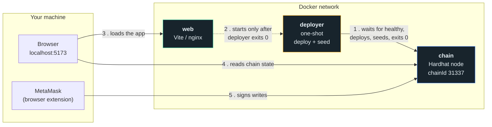
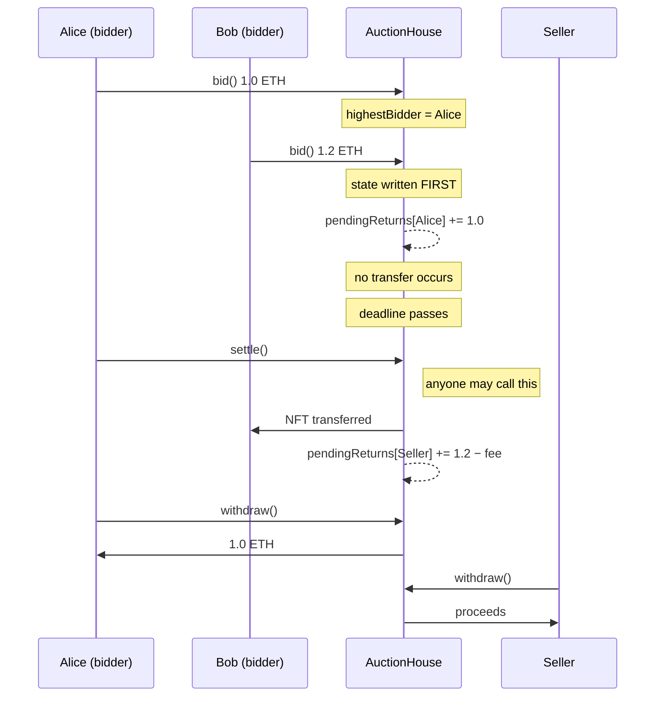
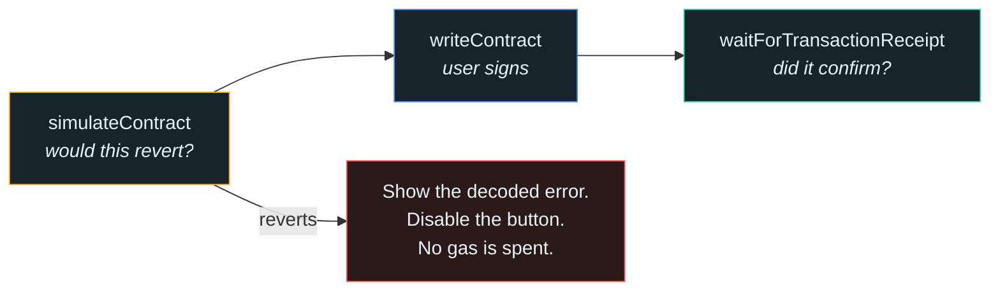

# Architecture

This document explains how the parts fit together and why each boundary exists.
It is written for a reader who has not seen the code.

---

## 1. Services

Three containers. Each one has a single job.



**The startup order is enforced, not guessed.** The previous version ran
`sleep 10 && npm run migrate` and hoped. It had three failure modes: the
migration could still be running when the browser asked for the contract, a
failed migration did not stop the frontend, and the contract address could
point at a chain that had been wiped.

The replacement uses two Compose primitives:

| Gate                         | Primitive                                   | Meaning                            |
| ---------------------------- | ------------------------------------------- | ---------------------------------- |
| `deployer` waits for `chain` | `condition: service_healthy`                | The node answers `eth_blockNumber` |
| `web` waits for `deployer`   | `condition: service_completed_successfully` | The deploy **exited 0**            |

If the deployment fails, the web service never starts. The stack fails loudly
instead of serving a broken page.

---

## 2. How the contract address reaches the browser

This was the most fragile part of the old design. A Docker named volume carried
the compiled artifact from the backend container to the frontend container. The
frontend then searched the artifact for a network entry that matched the chain.

That coupled three separate concerns into one file, and it broke whenever the
chain was reset but the volume was not.

The rebuild separates them:

| Concern     | Changes when                | Delivery                                                                                             |
| ----------- | --------------------------- | ---------------------------------------------------------------------------------------------------- |
| **ABI**     | The contract source changes | Generated into `web/src/abi/` and **committed**. Reviewed in pull requests. CI fails if it is stale. |
| **Address** | Every deployment            | Runtime configuration. Never compiled into the bundle.                                               |

In production, an nginx entrypoint script writes the address into
`/usr/share/nginx/html/config.js` before the server starts:

```js
window.__AUCTION_CONFIG__ = {
  chainId: 31337,
  rpcUrl: "http://127.0.0.1:8545",
  auctionHouse: "0xe7f1725E7734CE288F8367e1Bb143E90bb3F0512",
  demoNft: "0x5FbDB2315678afecb367f032d93F642f64180aa3",
};
```

The application resolves configuration in this order:

```
window.__AUCTION_CONFIG__   →   import.meta.env.VITE_*   →   local defaults
```

One image therefore runs against any chain. Nothing needs rebuilding to change
the address.

---

## 3. Money flow

The single most important design rule: **the contract never sends ETH on its
own initiative.**



Three consequences follow, and each one closes a critical finding from the
audit:

1. **A hostile bidder can harm only itself.** In the old contract a refund was
   a direct call wrapped in `require(success)`. A contract that reverted on
   receipt made every later bid fail, which froze the auction at the attacker's
   own minimum bid. Now the refund is a ledger entry, and a ledger entry cannot
   revert.

2. **Reentrancy has nothing to re-enter.** The old `bid()` sent the refund
   _before_ updating state, so the attacker's `receive()` ran while the contract
   still believed they were the highest bidder. Now state is written first,
   every payable function carries `nonReentrant`, and no external call happens
   during a state transition.

3. **Nobody can be locked out.** The old contract had no `withdraw()` and no
   deadline. A losing bid was recoverable only if a third party happened to
   outbid it, so the ordinary outcome of a quiet auction was permanent loss.
   Now there is a deadline, **anyone** may settle after it, and the vault is
   always open — including while the contract is paused.

Per-auction escrow accounting completes the picture: the contract tracks what
each auction holds, so one auction can never spend another's balance. That was
the mechanism the reentrancy exploit used to steal money.

---

## 4. Anti-snipe

An auction with a hard close rewards bidding in the final block. That
suppresses honest price discovery, because the winning strategy is to hide your
valuation until nobody can respond.

A bid inside the final five minutes therefore pushes the deadline out to five
minutes from now:

```
        bid arrives here
              │
   ───────────┼──────────────▶  original endTime
              │◀── 5 min ──▶│
                             └──▶ new endTime
```

Extensions are capped at 20 so an adversary cannot hold an auction open forever
with minimum-increment bids. The cap is why a real minimum increment ships in
the same change — without one, the two features fight each other.

The interface shows each extension as it happens, so a viewer understands why
the clock moved.

---

## 5. Reading chain state

The old application called `items(i)` in a loop, awaiting each result. With 50
auctions that is 50 sequential round trips. It also re-ran the entire load
whenever an unrelated UI toggle changed, and it copied contract values into
`useState`, so a card kept showing a stale price after the auction moved on.

The rebuild:

- **One multicall** (`useReadContracts`) fetches every auction in a single
  request.
- **TanStack Query owns all chain data.** Nothing is copied into component
  state, so nothing can go stale.
- **Contract events drive updates.** `useWatchContractEvent` invalidates the
  affected query when `BidPlaced` or `AuctionSettled` fires. The UI reacts to
  the chain instead of polling it.

---

## 6. Writing to the chain

Every write follows the same three steps:



The simulation step matters twice over. It stops the user paying gas for a
transaction that cannot succeed, and because the contract uses custom errors
rather than strings, it can say _"Your bid must be at least 2.52 ETH"_ instead
of _"Failed to place bid."_

The receipt step matters more. The old application called a write, caught its
own error, logged a warning, and continued — so it displayed
_"Auction ended successfully!"_ on **every** failure, including a rejected
signature. Success is now claimed only after a receipt confirms it.

---

## 7. Deliberate omissions

| Not built                 | Reason                                                                                                                                             |
| ------------------------- | -------------------------------------------------------------------------------------------------------------------------------------------------- |
| Upgradeable proxy (UUPS)  | Adds storage-layout discipline and a second dependency for no demonstration value. Immutability is a stronger property to be able to state.        |
| ERC-20 bidding            | Native ETH keeps the demonstration readable. The vault is already keyed by account, so adding a token dimension is mechanical.                     |
| Sealed-bid commit–reveal  | The correct answer to shill bidding and mempool front-running, but it needs two phases and a forfeit rule. Out of scope for a local demonstration. |
| Subgraph indexing         | Events are already indexed correctly for one, so this is additive. Direct log reads are fast enough at demonstration scale.                        |
| Public network deployment | Explicitly out of scope. The contract is unaudited.                                                                                                |

---

## 8. Trust model

Read this before considering the project for any real use.

- The contract is **unaudited**. It was written in response to an audit of an
  earlier version, which is not the same as having been audited itself.
- The owner can pause new listings, new bids and buy-now. The owner **cannot**
  block `withdraw()` or `settle()`. A pause must never be able to trap funds.
- The platform fee has a hard ceiling in code, so it cannot be raised
  arbitrarily.
- There is no admin key that can move a user's escrowed funds or NFT.
- Usernames are display data. They are not verified and MUST NOT be treated as
  identity.
